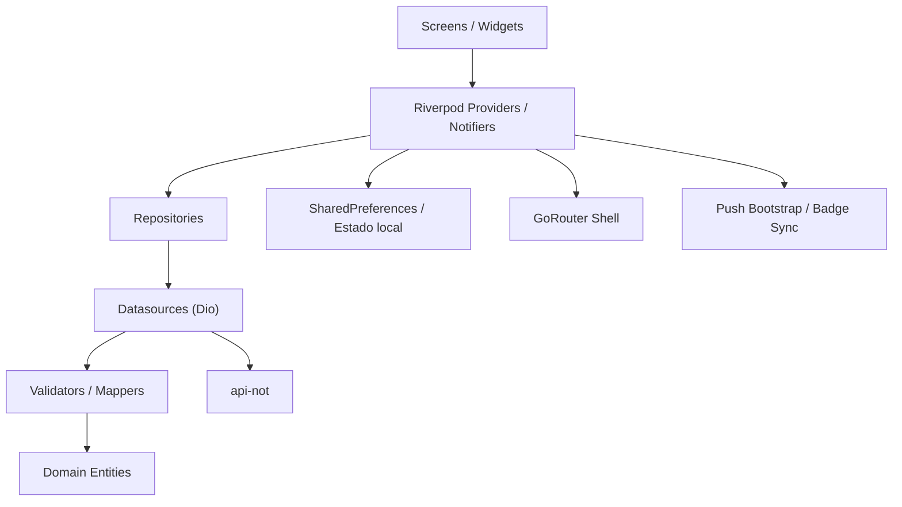
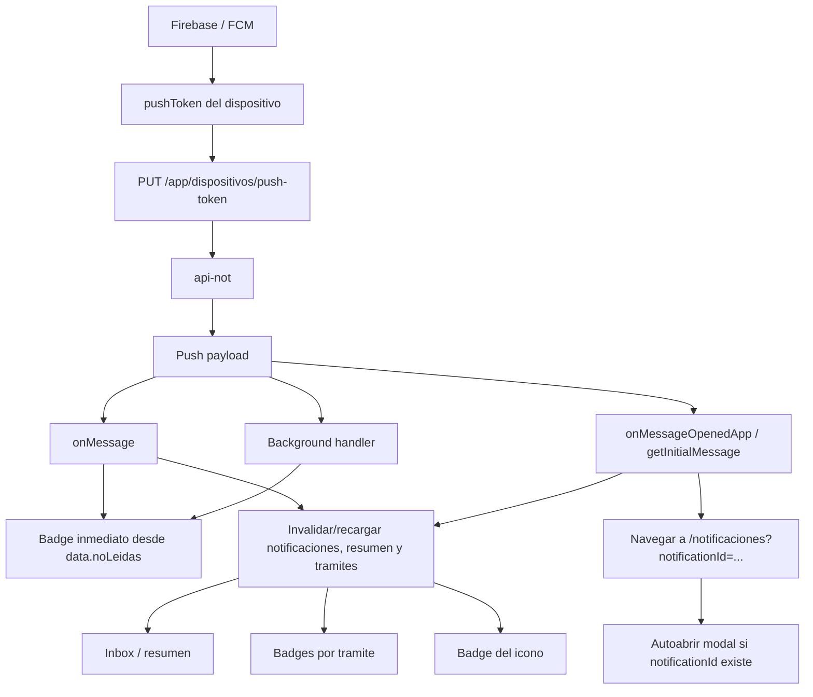

# Frontend Final Handover - `app-not`

**Proyecto:** `app-not`  
**Ruta del repo:** `C:\laragon\www\app-not\app-not`  
**Proposito del frontend:** cliente Flutter de NOT para autenticacion, modulos, tramites, notificaciones inbox/push y configuracion del usuario autenticado.  
**Fecha de ultima actualizacion:** `2026-04-07`  
**Estado general:** `Operativo, estable y listo para mantenimiento`  
**Pendiente funcional aceptado:** `hoja-ruta`

---

## Como mantener este documento

Este archivo es el documento vivo y canonico del frontend. No crear variantes tipo `v2`, `final-final`, `nuevo` o equivalentes.

Reglas de actualizacion:

1. Si cambia la arquitectura, editar las secciones `Arquitectura general`, `Mapa de carpetas` e `Inventario detallado`.
2. Si cambia navegacion, rutas, shell o tabs, editar `Navegacion y estado`.
3. Si cambia Riverpod, providers, repositories, datasources o mappers, editar `Arquitectura general`, `Inventario detallado` y `Comunicacion interna y dependencias`.
4. Si cambian endpoints, contratos, payloads o manejo de errores, editar `Integracion con backend`.
5. Si cambia FCM, badge, permisos o archivos nativos, editar `Push / Firebase / badge` y `Configuracion y variables`.
6. Si cambian tests o la estrategia de validacion, editar `Testing`.
7. Si una seccion deja de aplicar, corregirla o eliminarla en este mismo archivo.
8. Al finalizar cualquier cambio relevante, actualizar fecha, estado general, pendiente funcional aceptado e historial del documento.

Criterio para no dejarlo desactualizado:

- Todo cambio que afecte runtime, configuracion, navegacion, push, contratos o testing debe venir acompanado por la actualizacion de este archivo.
- Si el cambio es menor pero toca nombres, paths o metadata visible, tambien debe reflejarse aqui.

---

## Resumen ejecutivo

`app-not` es una app Flutter con arquitectura por features y capas (`presentation / domain / infrastructure`) que consume `api-not` mediante `Dio`, maneja estado con `Riverpod`, navega con `GoRouter` y sincroniza notificaciones internas y push Android con FCM.

Estado actual por modulo:

- **Auth + sesion + `/app/me`:** listo.
- **Entidades:** listo.
- **Home + modulos:** listo.
- **Tramites + seguir/no seguir:** listo.
- **Notificaciones + resumen + modal + marcar leida:** listo.
- **Configuracion de notificaciones:** listo.
- **Push Android + badge launcher:** listo para Android fisico.
- **Hoja-ruta:** pendiente funcional aceptado; backend puede responder `501` y el frontend degrada de forma controlada.

Como se conecta con `api-not`:

- `POST /app/login` autentica y devuelve token.
- `GET /app/me` es la fuente unica de verdad del usuario autenticado.
- El resto de modulos consume endpoints especificos con validacion contractual estricta y mappers canonicos.

Veredicto general:

- El frontend esta **cerrado y mantenible** fuera de `hoja-ruta`.
- La navegacion principal esta estabilizada.
- El badge y la sincronizacion entre inbox, resumen y tramites ya estan conectados.
- Android es la plataforma operativa principal. iOS/macOS/Windows/Linux/Web quedan como soporte parcial o de compilacion.

---

## Arquitectura general

### Stack exacto

- Flutter
- `flutter_riverpod`
- `go_router`
- `dio`
- `shared_preferences`
- `flutter_dotenv`
- `firebase_core`
- `firebase_messaging`
- `flutter_local_notifications`
- `app_badge_plus`
- `formz`
- `google_fonts`

### Bootstrap desde `main.dart`

Archivo principal: `lib/main.dart`

Secuencia de arranque:

1. `WidgetsFlutterBinding.ensureInitialized()`
2. `Environment.initEnvironment()` para leer `/.env`
3. `AppPushBootstrap.preRunSetup()` para inicializacion temprana de Firebase/FCM Android
4. `ProviderScope`
5. `MaterialApp.router` con tema, router y wrappers globales

Wrappers globales montados:

- `AppSessionGuard`
- `AppPushBootstrap`
- `AppIconBadgeSync`

### `Environment`

Archivo principal: `lib/config/constants/environment.dart`

Responsabilidades:

- Cargar `/.env`
- Exponer `appName`, `appLema`, `appCopyright`
- Exponer `apiUrl`

Archivos de entorno:

- `.env` = archivo activo consumido por runtime
- `.env.emulator` = emulador Android
- `.env.device` = dispositivo fisico en LAN

### Riverpod

Patron adoptado:

- `Provider` para servicios y repositories
- `FutureProvider` para cargas simples o derivadas
- `NotifierProvider` / `NotifierProvider.autoDispose` para estado de interaccion y efectos

Caracteristicas del uso actual:

- No se usa `flutter_riverpod/legacy.dart`
- Los providers componen repositories, datasources y servicios
- Los notifiers disparan carga inicial con `Future.microtask(...)`
- Las resincronizaciones se resuelven con invalidaciones (`ref.invalidate(...)`) y actualizaciones locales controladas
- En cambio de sesion/usuario, `AppPushBootstrap` invalida cache user-scoped (`tramites`, `notificaciones`, `resumen`, preferencia de badge) y fuerza recarga para evitar estado cruzado.

### GoRouter

Archivo principal: `lib/config/router/app_router.dart`

Patron:

- `StatefulShellRoute.indexedStack`
- tres ramas principales:
  - `Inicio`
  - `Tramites`
  - `Notificaciones`
- rutas fuera de shell para:
  - checking de auth
  - login
  - consentimiento inicial

### Dio

Archivo principal: `lib/core/network/app_dio_provider.dart`

Responsabilidades:

- Crear cliente HTTP base con `baseUrl` de `Environment`
- Agregar `Authorization` cuando hay token
- Agregar `X-App-Device-Id`
- Interceptar `401`
- Publicar evento de sesion expirada en el `sessionEventBus`

### Repositories / Datasources / Mappers

Patron:

- `datasource` abstracto en `domain`
- implementacion en `infrastructure/datasources`
- `repository` abstracto en `domain`
- implementacion en `infrastructure/repositories`
- `mapper` en `infrastructure/mappers`

Objetivo:

- aislar el contrato backend del resto de la UI
- endurecer naming y shape
- fallar con errores controlados si el contrato se rompe

### Sesion

Archivo principal: `lib/features/auth/presentation/providers/auth_provider.dart`

Flujo:

1. Login guarda token y token type localmente
2. Luego llama `/app/me`
3. El estado autenticado final se arma con el usuario canonico de `/me`
4. `remember_session` controla si la sesion se rehidrata al abrir la app
5. Logout limpia storage local y trata el logout backend como best effort

### Tema

Archivo principal: `lib/config/theme/app_theme_mode_provider.dart`

Regla actual:

- instalacion nueva arranca en `light`
- el usuario puede cambiar a `dark` o `system`
- la preferencia se persiste en storage local con la clave `app_theme_mode`

### Push

Archivo principal: `lib/features/shared/presentation/widgets/app_push_bootstrap.dart`

Funciones:

- inicializar Firebase
- pedir permisos
- obtener token FCM
- registrar/invalidar token en backend
- manejar foreground/background/opened/getInitialMessage
- resincronizar inbox/resumen/tramites
- invalidar estado user-scoped al detectar cambio de usuario autenticado
- navegar a notificaciones desde push tap

### Badge

Archivos principales:

- `lib/features/shared/infrastructure/services/app_icon_badge_service.dart`
- `lib/features/shared/presentation/widgets/app_icon_badge_sync.dart`
- `lib/features/notificaciones/presentation/providers/notificaciones_provider.dart`

Funciones:

- mostrar u ocultar badge segun preferencia backend
- sincronizar badge del icono con no leidas
- propagar el mismo estado a header, bottom nav y home

### Patron por capas

```text
UI / Screen / Widget
  -> Provider / Notifier (Riverpod)
    -> Repository
      -> DataSource (Dio)
        -> Mapper / Contract validator
          -> Entity / State consumible por UI
```

### Flujo completo tipico

`UI -> provider -> repository -> datasource -> mapper -> entity`

Ejemplo real:

`NotificacionesScreen -> notificacionesProvider -> NotificacionesRepositoryImpl -> NotificacionesDataSourceImpl -> NotificacionMapper -> Notificacion`

---

## Mapa de carpetas del repo

### Raiz

Proposito: manifest, configuracion global, entornos y documentacion.

Partes relevantes:

- `pubspec.yaml`: runtime/config
- `pubspec.lock`: soporte
- `analysis_options.yaml`: linting
- `.env`, `.env.emulator`, `.env.device`: configuracion operativa
- `README.md`: documentacion operativa
- `.metadata`: soporte Flutter
- `.flutter-plugins-dependencies`: generado local
- `devtools_options.yaml`: soporte local

### `lib/`

Proposito: runtime completo del frontend.

Subcarpetas:

- `config/`
- `core/`
- `features/`

Todo `lib/` es runtime activo salvo archivos barrel y tokens, que igualmente forman parte del runtime.

### `lib/config/`

Proposito: router, constants y tema.

Subcarpetas:

- `constants/`
- `router/`
- `theme/`

Tipo predominante: runtime activo.

### `lib/core/`

Proposito: infraestructura compartida de red, errores, sesion, push y storage keys.

Subcarpetas:

- `errors/`
- `network/`
- `push/`
- `session/`
- `storage/`

Tipo predominante: runtime activo.

### `lib/features/auth/`

Proposito: login, entidades, sesion y usuario canonico.

Subcarpetas:

- `domain/`
- `infrastructure/`
- `presentation/`

Tipo predominante: runtime activo.

### `lib/features/home/`

Proposito: home de modulos y resolucion de rutas de cada modulo.

Subcarpetas:

- `domain/`
- `infrastructure/`
- `presentation/`

Tipo predominante: runtime activo.

### `lib/features/tramites/`

Proposito: listado de tramites, seguimiento, hoja-ruta.

Subcarpetas:

- `domain/`
- `infrastructure/`
- `presentation/`

Tipo predominante: runtime activo.

### `lib/features/notificaciones/`

Proposito: inbox, resumen, configuracion y sincronizacion de no leidas.

Subcarpetas:

- `domain/`
- `infrastructure/`
- `presentation/`

Tipo predominante: runtime activo.

### `lib/features/shared/`

Proposito: shell, layout, pantallas transversales, storage, badge y push.

Subcarpetas:

- `infrastructure/`
- `presentation/`

Tipo predominante: runtime activo.

### `test/`

Proposito: pruebas unitarias/widget/support.

Subcarpetas:

- `auth/`
- `home/`
- `navigation/`
- `notificaciones/`
- `tramites/`
- `support/`

Tipo predominante: test.

### `assets/`

Proposito: branding, iconos y tipografia.

Subcarpetas:

- `fonts/`
- `icon/`
- `img/`

Tipo predominante: runtime activo.

### `android/`

Proposito: plataforma principal de ejecucion real.

Subcarpetas relevantes:

- `app/`
- `gradle/`

Tipo mixto:

- runtime/plataforma activo
- archivos generados
- recursos nativos

### `ios/`

Proposito: scaffold iOS.

Subcarpetas relevantes:

- `Runner/`
- `Runner.xcodeproj/`
- `Runner.xcworkspace/`
- `Flutter/`
- `RunnerTests/`

Tipo mixto:

- soporte/plataforma
- generado
- test de plataforma

### `macos/`

Proposito: soporte de compilacion macOS.

Subcarpetas relevantes:

- `Runner/`
- `Runner.xcodeproj/`
- `Runner.xcworkspace/`
- `Flutter/`
- `RunnerTests/`

Tipo mixto:

- soporte/plataforma
- generado
- test de plataforma

### `windows/`

Proposito: soporte de compilacion Windows.

Subcarpetas relevantes:

- `runner/`
- `flutter/`

Tipo mixto:

- soporte/plataforma
- generado

### `linux/`

Proposito: soporte de compilacion Linux.

Subcarpetas relevantes:

- `runner/`
- `flutter/`

Tipo mixto:

- soporte/plataforma
- generado

### `web/`

Proposito: soporte web parcial.

Subcarpetas relevantes:

- `icons/`

Tipo mixto:

- soporte/plataforma
- assets web

---

## Inventario detallado de archivos relevantes

### Bootstrap, config y core

| Ruta | Funcion exacta | Modulo | Tipo |
|---|---|---|---|
| `lib/main.dart` | Entry point; inicializa env, push y monta wrappers globales | App | Runtime activo |
| `lib/config/config.dart` | Barrel de configuracion | App | Runtime activo |
| `lib/config/constants/environment.dart` | Lee `.env` y expone configuracion global | App | Runtime activo |
| `lib/config/constants/app_metadata.dart` | Version y metadata visible de la app | App | Runtime activo |
| `lib/config/router/app_router.dart` | Define router, shell, redirects y rutas | App | Runtime activo |
| `lib/config/theme/app_theme.dart` | Construye tema light/dark | App | Runtime activo |
| `lib/config/theme/app_theme_mode_provider.dart` | Persiste y recupera modo de tema | App | Runtime activo |
| `lib/config/theme/app_theme_colors.dart` | Paleta base | UI | Runtime activo |
| `lib/config/theme/app_text_styles.dart` | Tipografias | UI | Runtime activo |
| `lib/config/theme/app_spacing.dart` | Espaciados | UI | Runtime activo |
| `lib/config/theme/app_radii.dart` | Radios/bordes | UI | Runtime activo |
| `lib/config/theme/app_shadows.dart` | Sombras | UI | Runtime activo |
| `lib/config/theme/app_state_styles.dart` | Estados visuales reutilizables | UI | Runtime activo |
| `lib/config/theme/app_layout.dart` | Layout constants | UI | Runtime activo |
| `lib/config/theme/app_component_sizes.dart` | Tamanos de componentes | UI | Runtime activo |
| `lib/core/errors/app_failure.dart` | Modelo unificado de error | Core | Runtime activo |
| `lib/core/errors/dio_error_mapper.dart` | Traduce errores HTTP/Dio a `AppFailure` | Core | Runtime activo |
| `lib/core/errors/app_error_formatter.dart` | Formatea errores para UI | Core | Runtime activo |
| `lib/core/errors/response_contract_validator.dart` | Valida contratos backend y falla de forma controlada | Core | Runtime activo |
| `lib/core/errors/errors.dart` | Barrel de errores | Core | Runtime activo |
| `lib/core/network/app_dio_provider.dart` | Crea Dio, inyecta auth/deviceId y maneja `401` | Core | Runtime activo |
| `lib/core/push/device_id_service.dart` | Obtiene `deviceId` estable (`ANDROID_ID`) y lo persiste; fallback aleatorio solo si falla | Push/Auth | Runtime activo |
| `lib/core/push/push_navigation_intent_provider.dart` | Cola de intenciones de navegacion por push hasta que la sesion este lista | Push/UI | Runtime activo |
| `lib/core/push/push_token_backend_client.dart` | Registra/invalida el token push en backend | Push | Runtime activo |
| `lib/core/session/session_event_bus.dart` | Canal de evento global de sesion expirada | Auth | Runtime activo |
| `lib/core/storage/session_storage_keys.dart` | Claves de persistencia local | Auth/Push | Runtime activo |

### Auth

| Ruta | Funcion exacta | Modulo | Tipo |
|---|---|---|---|
| `lib/features/auth/domain/domain.dart` | Barrel del dominio auth | Auth | Runtime activo |
| `lib/features/auth/domain/datasources/auth_datasource.dart` | Contrato abstracto de auth datasource | Auth | Runtime activo |
| `lib/features/auth/domain/datasources/entidad_datasource.dart` | Contrato abstracto de entidades | Auth | Runtime activo |
| `lib/features/auth/domain/entities/user.dart` | Entidad usuario autenticado | Auth | Runtime activo |
| `lib/features/auth/domain/entities/entidad.dart` | Entidad de empresa/entidad disponible para login | Auth | Runtime activo |
| `lib/features/auth/domain/repositories/auth_repository.dart` | Contrato abstracto repo auth | Auth | Runtime activo |
| `lib/features/auth/domain/repositories/entidad_repository.dart` | Contrato abstracto repo entidades | Auth | Runtime activo |
| `lib/features/auth/infrastructure/infrastructure.dart` | Barrel infraestructura auth | Auth | Runtime activo |
| `lib/features/auth/infrastructure/datasources/auth_datasource_impl.dart` | Implementa login, `/me`, logout | Auth | Runtime activo |
| `lib/features/auth/infrastructure/datasources/entidad_datasource_impl.dart` | Implementa `POST /app/entidades` | Auth | Runtime activo |
| `lib/features/auth/infrastructure/inputs/username.dart` | Validacion Formz de username | Auth | Runtime activo |
| `lib/features/auth/infrastructure/inputs/password.dart` | Validacion Formz de password | Auth | Runtime activo |
| `lib/features/auth/infrastructure/inputs/inputs.dart` | Barrel de inputs | Auth | Runtime activo |
| `lib/features/auth/infrastructure/mappers/user_mapper.dart` | Mapea token y usuario canonico de `/me` | Auth | Runtime activo |
| `lib/features/auth/infrastructure/mappers/entidad_mapper.dart` | Mapea entidades | Auth | Runtime activo |
| `lib/features/auth/infrastructure/repositories/auth_repository_impl.dart` | Repo auth concreto | Auth | Runtime activo |
| `lib/features/auth/infrastructure/repositories/entidad_repository_impl.dart` | Repo entidades concreto | Auth | Runtime activo |
| `lib/features/auth/presentation/providers/auth_provider.dart` | Estado de sesion, login, restore, logout, consentimiento | Auth | Runtime activo |
| `lib/features/auth/presentation/providers/login_form_provider.dart` | Estado del formulario de login | Auth | Runtime activo |
| `lib/features/auth/presentation/providers/entidad_provider.dart` | Carga entidades | Auth | Runtime activo |
| `lib/features/auth/presentation/providers/providers.dart` | Barrel providers auth | Auth | Runtime activo |
| `lib/features/auth/presentation/screens/login_screen.dart` | Pantalla de autenticacion | Auth | Runtime activo |
| `lib/features/auth/presentation/screens/screens.dart` | Barrel screens auth | Auth | Runtime activo |

### Home

| Ruta | Funcion exacta | Modulo | Tipo |
|---|---|---|---|
| `lib/features/home/domain/domain.dart` | Barrel del dominio home | Home | Runtime activo |
| `lib/features/home/domain/datasources/module_datasource.dart` | Contrato datasource modulos | Home | Runtime activo |
| `lib/features/home/domain/entities/module.dart` | Entidad modulo | Home | Runtime activo |
| `lib/features/home/domain/repositories/module_repository.dart` | Contrato repo modulos | Home | Runtime activo |
| `lib/features/home/infrastructure/infrastructure.dart` | Barrel infraestructura home | Home | Runtime activo |
| `lib/features/home/infrastructure/datasources/module_datasource_impl.dart` | Consume `GET /app/modulos` | Home | Runtime activo |
| `lib/features/home/infrastructure/mappers/module_mapper.dart` | Mapea modulo canonico | Home | Runtime activo |
| `lib/features/home/infrastructure/repositories/module_repository_impl.dart` | Repo modulos concreto | Home | Runtime activo |
| `lib/features/home/presentation/helpers/module_route_resolver.dart` | Resuelve rutas por ID canonico y fallback acotado | Home | Runtime activo |
| `lib/features/home/presentation/providers/module_provider.dart` | Wire Riverpod repo/datasource de modulos | Home | Runtime activo |
| `lib/features/home/presentation/providers/providers.dart` | Barrel providers home | Home | Runtime activo |
| `lib/features/home/presentation/screens/home_screen.dart` | Home principal de la app | Home | Runtime activo |
| `lib/features/home/presentation/screens/module_placeholder_screen.dart` | Placeholder para modulos no implementados | Home | Runtime activo |
| `lib/features/home/presentation/screens/screens.dart` | Barrel screens home | Home | Runtime activo |

### Tramites

| Ruta | Funcion exacta | Modulo | Tipo |
|---|---|---|---|
| `lib/features/tramites/domain/domain.dart` | Barrel del dominio tramites | Tramites | Runtime activo |
| `lib/features/tramites/domain/datasources/tramites_datasource.dart` | Contrato datasource tramites | Tramites | Runtime activo |
| `lib/features/tramites/domain/entities/tramite.dart` | Entidad tramite | Tramites | Runtime activo |
| `lib/features/tramites/domain/entities/tramite_movimiento.dart` | Entidad movimiento de hoja-ruta | Tramites | Runtime activo |
| `lib/features/tramites/domain/repositories/tramites_repository.dart` | Contrato repo tramites | Tramites | Runtime activo |
| `lib/features/tramites/infrastructure/infrastructure.dart` | Barrel infraestructura tramites | Tramites | Runtime activo |
| `lib/features/tramites/infrastructure/datasources/tramites_datasource_impl.dart` | Consume listado, seguir/no seguir y hoja-ruta | Tramites | Runtime activo |
| `lib/features/tramites/infrastructure/mappers/tramite_mapper.dart` | Mapea tramite | Tramites | Runtime activo |
| `lib/features/tramites/infrastructure/mappers/tramite_movimiento_mapper.dart` | Mapea movimiento | Tramites | Runtime activo |
| `lib/features/tramites/infrastructure/repositories/tramites_repository_impl.dart` | Repo tramites concreto | Tramites | Runtime activo |
| `lib/features/tramites/presentation/providers/tramites_provider.dart` | Notifier de listado, seguimiento y badge por tramite | Tramites | Runtime activo |
| `lib/features/tramites/presentation/providers/providers.dart` | Barrel providers tramites | Tramites | Runtime activo |
| `lib/features/tramites/presentation/screens/tramites_screen.dart` | Pantalla de tramites con dos secciones | Tramites | Runtime activo |
| `lib/features/tramites/presentation/screens/tramite_hoja_ruta_screen.dart` | Pantalla de hoja-ruta con degradacion `501` | Tramites | Runtime activo |
| `lib/features/tramites/presentation/screens/screens.dart` | Barrel screens tramites | Tramites | Runtime activo |
| `lib/features/tramites/presentation/widgets/tramite_card.dart` | Card de tramite, badge, seguimiento y hoja-ruta | Tramites | Runtime activo |
| `lib/features/tramites/presentation/widgets/tramites_section.dart` | Seccion UI reutilizable | Tramites | Runtime activo |
| `lib/features/tramites/presentation/widgets/widgets.dart` | Barrel widgets tramites | Tramites | Runtime activo |

### Notificaciones

| Ruta | Funcion exacta | Modulo | Tipo |
|---|---|---|---|
| `lib/features/notificaciones/domain/domain.dart` | Barrel del dominio notificaciones | Notificaciones | Runtime activo |
| `lib/features/notificaciones/domain/datasources/notificaciones_datasource.dart` | Contrato datasource notificaciones | Notificaciones | Runtime activo |
| `lib/features/notificaciones/domain/entities/notificacion.dart` | Entidad de notificacion | Notificaciones | Runtime activo |
| `lib/features/notificaciones/domain/entities/notificaciones_resumen.dart` | Entidad resumen de no leidas | Notificaciones | Runtime activo |
| `lib/features/notificaciones/domain/entities/notificacion_configuracion.dart` | Entidad de configuracion | Notificaciones | Runtime activo |
| `lib/features/notificaciones/domain/repositories/notificaciones_repository.dart` | Contrato repo notificaciones | Notificaciones | Runtime activo |
| `lib/features/notificaciones/infrastructure/infrastructure.dart` | Barrel infraestructura notificaciones | Notificaciones | Runtime activo |
| `lib/features/notificaciones/infrastructure/datasources/notificaciones_datasource_impl.dart` | Consume inbox, resumen, marcar leida y configuracion | Notificaciones | Runtime activo |
| `lib/features/notificaciones/infrastructure/mappers/notificacion_mapper.dart` | Mapea listado de notificaciones | Notificaciones | Runtime activo |
| `lib/features/notificaciones/infrastructure/mappers/notificaciones_resumen_mapper.dart` | Mapea resumen de no leidas | Notificaciones | Runtime activo |
| `lib/features/notificaciones/infrastructure/mappers/notificacion_configuracion_mapper.dart` | Mapea configuracion y serializa payload snake_case | Notificaciones | Runtime activo |
| `lib/features/notificaciones/infrastructure/repositories/notificaciones_repository_impl.dart` | Repo notificaciones concreto | Notificaciones | Runtime activo |
| `lib/features/notificaciones/presentation/providers/notificaciones_provider.dart` | Notifier inbox/resumen/badge/mark-as-read | Notificaciones | Runtime activo |
| `lib/features/notificaciones/presentation/providers/notificacion_configuracion_provider.dart` | Notifier de configuracion de notificaciones | Notificaciones | Runtime activo |
| `lib/features/notificaciones/presentation/providers/providers.dart` | Barrel providers notificaciones | Notificaciones | Runtime activo |
| `lib/features/notificaciones/presentation/screens/notificaciones_screen.dart` | Pantalla de inbox con modal y query `notificationId` | Notificaciones | Runtime activo |
| `lib/features/notificaciones/presentation/screens/screens.dart` | Barrel screens notificaciones | Notificaciones | Runtime activo |
| `lib/features/notificaciones/presentation/widgets/notificacion_card.dart` | Card de notificacion, ojo, estado leida/no leida | Notificaciones | Runtime activo |
| `lib/features/notificaciones/presentation/widgets/widgets.dart` | Barrel widgets notificaciones | Notificaciones | Runtime activo |

### Shared / Shell / Servicios comunes

| Ruta | Funcion exacta | Modulo | Tipo |
|---|---|---|---|
| `lib/features/shared/infrastructure/services/key_value_storage_service.dart` | Abstraccion de storage local | Shared | Runtime activo |
| `lib/features/shared/infrastructure/services/key_value_storage_service_impl.dart` | Implementacion SharedPreferences | Shared | Runtime activo |
| `lib/features/shared/infrastructure/services/key_value_storage_service_provider.dart` | Provider del servicio de storage | Shared | Runtime activo |
| `lib/features/shared/infrastructure/services/app_icon_badge_service.dart` | Servicio de badge launcher | Shared | Runtime activo |
| `lib/features/shared/infrastructure/widgets/app_inline_banner.dart` | Banner de feedback inline | Shared | Runtime activo |
| `lib/features/shared/infrastructure/widgets/custom_text_form_field.dart` | Campo reutilizable | Shared | Runtime activo |
| `lib/features/shared/infrastructure/widgets/widgets.dart` | Barrel widgets infraestructura shared | Shared | Runtime activo |
| `lib/features/shared/presentation/helpers/app_dialog_helper.dart` | Helper de dialogos | Shared | Runtime activo |
| `lib/features/shared/presentation/helpers/app_snack_bar_helper.dart` | Helper de snackbars | Shared | Runtime activo |
| `lib/features/shared/presentation/helpers/helpers.dart` | Barrel helpers shared | Shared | Runtime activo |
| `lib/features/shared/presentation/screens/auth_checking_screen.dart` | Pantalla de checking auth/splash | Shared | Runtime activo |
| `lib/features/shared/presentation/screens/my_data_screen.dart` | Pantalla canonica de “Mis datos” | Shared | Runtime activo |
| `lib/features/shared/presentation/screens/notification_settings_screen.dart` | Pantalla de configuracion de notificaciones | Shared | Runtime activo |
| `lib/features/shared/presentation/screens/theme_settings_screen.dart` | Pantalla de tema | Shared | Runtime activo |
| `lib/features/shared/presentation/screens/legal_information_screen.dart` | Menu legal | Shared | Runtime activo |
| `lib/features/shared/presentation/screens/terms_conditions_screen.dart` | Pantalla “Terminos y condiciones” | Shared | Runtime activo |
| `lib/features/shared/presentation/screens/about_screen.dart` | Pantalla “Acerca de” | Shared | Runtime activo |
| `lib/features/shared/presentation/screens/data_protection_consent_screen.dart` | Consentimiento y lectura legal de proteccion de datos | Shared | Runtime activo |
| `lib/features/shared/presentation/screens/layouts/app_main_shell_screen.dart` | Shell principal y navegacion de tabs | Shared | Runtime activo |
| `lib/features/shared/presentation/screens/layouts/header.dart` | Header con campana, badge y acciones | Shared | Runtime activo |
| `lib/features/shared/presentation/widgets/app_main_navigation.dart` | Bottom navigation con badge | Shared | Runtime activo |
| `lib/features/shared/presentation/widgets/app_push_bootstrap.dart` | Bootstrap FCM, listeners, navegacion push y reset de cache por cambio de usuario | Shared | Runtime activo |
| `lib/features/shared/presentation/widgets/app_session_guard.dart` | Guarda de sesion expirada | Shared | Runtime activo |
| `lib/features/shared/presentation/widgets/app_icon_badge_sync.dart` | Sincronizacion global del badge del icono | Shared | Runtime activo |

### Tests

| Ruta | Funcion exacta | Modulo | Tipo |
|---|---|---|---|
| `test/widget_test.dart` | Smoke minimo de checking | Test | Test |
| `test/auth/auth_notifier_test.dart` | Login, restore session, logout | Auth | Test |
| `test/home/module_route_resolver_test.dart` | Resolucion canonica de modulos | Home | Test |
| `test/navigation/app_router_shell_test.dart` | Shell/tabs alineados | Navegacion | Test |
| `test/notificaciones/notificaciones_provider_test.dart` | Orden, resumen, mark-as-read, badge visibility | Notificaciones | Test |
| `test/tramites/tramites_notifier_test.dart` | Seguimiento y badge por tramite | Tramites | Test |
| `test/tramites/tramite_hoja_ruta_screen_test.dart` | Degradacion controlada `501` | Tramites | Test |
| `test/support/test_app.dart` | Bootstrap de test con router/env en memoria | Support | Test |
| `test/support/test_fakes.dart` | Dobles de prueba | Support | Test |

### Archivos de plataforma relevantes

| Ruta | Funcion exacta | Modulo | Tipo |
|---|---|---|---|
| `android/app/build.gradle.kts` | Config Android, namespace, applicationId y Google Services plugin | Android | Soporte/plataforma |
| `android/app/google-services.json` | Config Firebase Android | Android/Push | Soporte/plataforma |
| `android/app/src/main/AndroidManifest.xml` | Permisos, label, metadata FCM/canal | Android | Soporte/plataforma |
| `android/app/src/main/kotlin/com/gorecalloa/app/MainActivity.kt` | Entry Activity Android | Android | Soporte/plataforma |
| `ios/Runner/AppDelegate.swift` | Entry iOS | iOS | Soporte/plataforma |
| `ios/Runner/Info.plist` | Nombre visible iOS y plist base | iOS | Soporte/plataforma |
| `ios/Runner.xcodeproj/project.pbxproj` | Bundle ids y build settings iOS | iOS | Soporte/plataforma |
| `macos/Runner/Configs/AppInfo.xcconfig` | Nombre visible y bundle id macOS | macOS | Soporte/plataforma |
| `macos/Runner.xcodeproj/project.pbxproj` | Build settings macOS y RunnerTests | macOS | Soporte/plataforma |
| `windows/runner/main.cpp` | Entry Windows y titulo de ventana | Windows | Soporte/plataforma |
| `windows/runner/Runner.rc` | Metadata de producto en Windows | Windows | Soporte/plataforma |
| `linux/CMakeLists.txt` | BINARY_NAME y APPLICATION_ID Linux | Linux | Soporte/plataforma |
| `linux/runner/my_application.cc` | Titulo y fondo inicial Linux | Linux | Soporte/plataforma |
| `web/index.html` | Shell web y metadata HTML | Web | Soporte/plataforma |
| `web/manifest.json` | Manifest PWA y metadata visible web | Web | Soporte/plataforma |

---

## Navegacion y estado

### Estructura del router

Archivo central: `lib/config/router/app_router.dart`

Rutas fuera de shell:

- `/checking`
- `/`
- `/consent`

Rutas dentro de shell:

- `/home`
- `/tramites`
- `/notificaciones`
- `/tramites/:id/hoja-ruta`
- `/mi-cuenta/datos`
- `/ajustes/tema`
- `/ajustes/notificaciones`
- `/informacion/legal`
- `/informacion/proteccion-datos`
- `/informacion/terminos-condiciones`
- `/informacion/acerca-de`
- `/modulo/:moduleId`

### Patron real de navegacion

- `go`: navegacion principal y entre ramas
- `pop`: retorno/cierre local
- `push`: no es el patron principal del runtime de la shell

### Como se resolvio la desincronizacion tab/ruta/contenido

Problema historico:

- la app podia dejar pantallas internas montadas sobre otra rama de tabs

Solucion actual:

- `AppMainShellScreen` fuerza navegacion a rutas raiz absolutas (`/home`, `/tramites`, `/notificaciones`) al cambiar de tab
- no se delega la consistencia visual a `goBranch` solamente
- esto evita que el tab activo no coincida con el contenido visible

### Providers principales

- `authProvider`
- `entidadesProvider`
- `modulesProvider`
- `tramitesProvider`
- `tramiteHojaRutaProvider`
- `notificacionesProvider`
- `notificacionesNoLeidasProvider`
- `notificacionesBadgeVisiblePreferenceProvider`
- `notificacionesUnreadBadgeUiProvider`
- `notificacionConfiguracionProvider`
- `appThemeModeProvider`
- `sessionEventProvider`

### Estado persistido localmente

- `access_token`
- `token_type`
- `remember_session`
- `push_device_id`
- `push_token`
- `data_policy_acceptance_user_*`
- `app_theme_mode`
- `show_unread_notifications_badge`

### Estado que viene del backend

- usuario autenticado (`/app/me`)
- entidades
- modulos
- tramites
- hoja-ruta
- inbox de notificaciones
- resumen de no leidas
- configuracion de notificaciones

### Sincronizacion entre notificaciones, resumen, tramites y badge

Al marcar una notificacion como leida:

1. se hace `PATCH /app/notificaciones/{id}/leida`
2. se actualiza la lista local de notificaciones
3. se decrementa `noLeidas` en estado local
4. se invalida `notificacionesNoLeidasProvider`
5. se decrementa el badge del tramite relacionado en `tramitesProvider`
6. el badge del header/bottom nav/home se recalcula
7. el launcher badge se resincroniza

Al recibir push:

1. si llega `data.noLeidas`, se actualiza badge launcher inmediato
2. luego se invalida o recarga inbox/resumen/tramites
3. si el usuario toca la notificacion, se navega al modulo `Notificaciones`
4. si viene `notificationId`, se abre el modal exacto

---

## Integracion con backend

### Endpoints consumidos

| Endpoint | Metodo | Modulo |
|---|---|---|
| `/app/login` | `POST` | Auth |
| `/app/me` | `GET` | Auth / Mis datos |
| `/app/logout` | `POST` | Auth |
| `/app/entidades` | `POST` | Login |
| `/app/modulos` | `GET` | Home |
| `/app/tramites` | `GET` | Tramites |
| `/app/tramites/{id}/seguir` | `POST` | Tramites |
| `/app/tramites/{id}/seguir` | `DELETE` | Tramites |
| `/app/tramites/{id}/hoja-ruta` | `GET` | Hoja-ruta |
| `/app/notificaciones` | `GET` | Notificaciones |
| `/app/notificaciones/resumen` | `GET` | Notificaciones / Badge |
| `/app/notificaciones/{id}/leida` | `PATCH` | Notificaciones |
| `/app/notificaciones/configuracion` | `GET` | Configuracion de notificaciones |
| `/app/notificaciones/configuracion` | `PUT` | Configuracion de notificaciones |
| `/app/dispositivos/push-token` | `PUT` | Push |
| `/app/dispositivos/push-token` | `DELETE` | Push |

### Que modulo consume que datasource/repository

- Auth:
  - datasource: `AuthDataSourceImpl`
  - repository: `AuthRepositoryImpl`
- Entidades:
  - datasource: `EntidadDatasourceImpl`
  - repository: `EntidadRepositoryImpl`
- Home:
  - datasource: `ModuleDataSourceImpl`
  - repository: `ModuleRepositoryImpl`
- Tramites:
  - datasource: `TramitesDataSourceImpl`
  - repository: `TramitesRepositoryImpl`
- Notificaciones:
  - datasource: `NotificacionesDataSourceImpl`
  - repository: `NotificacionesRepositoryImpl`
- Push token:
  - cliente directo `PushTokenBackendClient`

### Como se maneja login

1. login usa `POST /app/login`
2. obtiene/crea `deviceId` persistido (`SessionStorageKeys.pushDeviceId`)
3. payload de login: `codUsuario`, `password`, `codEmp`, `deviceId`
4. el backend devuelve token
5. el frontend lo persiste en storage
6. recien entonces llama `GET /app/me`
7. el estado autenticado final se arma con el usuario canonico de `/me`

### Como se hidrata `/app/me`

- fuente unica de verdad del usuario autenticado
- mapeado por `UserMapper`
- usado por:
  - auth state
  - Mis datos
  - disponibilidad de sesion
  - consentimiento por usuario

### Como se maneja `401`

- `app_dio_provider.dart` intercepta `401`
- excluye endpoints publicos como login/entidades
- publica `sessionExpired`
- `AppSessionGuard` limpia sesion y muestra feedback

### Como se maneja `501` de `hoja-ruta`

- `TramitesDataSourceImpl` traduce el caso a error controlado
- `TramiteHojaRutaScreen` muestra mensaje intencional
- no hay crash
- no hay spinner infinito

### Validacion contractual

Se valida de forma estricta con:

- `ResponseContractValidator`
- mappers especificos por endpoint
- naming canonico confirmado
- sin envelopes alternos silenciosos en endpoints criticos

### Registro de dispositivos push

Archivo clave: `lib/core/push/push_token_backend_client.dart`

Payload enviado:

- `deviceId`
- `pushToken`
- `platform`
- `deviceName`
- `appVersion`

Se registra:

- al tener sesion autenticada
- al refrescar token

Se invalida:

- en logout o expiracion de sesion, si es viable

### Como se actualiza badge segun backend

Fuentes:

- `GET /app/notificaciones/resumen`
- `GET /app/notificaciones/configuracion`
- `data.noLeidas` del payload push

Logica:

- `mostrar_contador_no_leidas = false` oculta badges UI y fuerza badge launcher a `0`
- `mostrar_contador_no_leidas = true` permite usar el conteo real

---

## Push / Firebase / badge

### Donde se inicializa Firebase

Archivo: `lib/features/shared/presentation/widgets/app_push_bootstrap.dart`

Puntos de inicializacion:

- `preRunSetup()` antes de montar la app
- `_setupRuntime()` durante el ciclo de vida del widget

### Archivos que intervienen y que hace cada uno

- `lib/features/shared/presentation/widgets/app_push_bootstrap.dart`
  - inicializa Firebase
  - pide permisos
  - obtiene token
  - escucha foreground/background/opened
  - navega a notificaciones
  - resincroniza providers
- `lib/core/push/push_token_backend_client.dart`
  - `PUT` y `DELETE` de token push
- `lib/features/shared/infrastructure/services/app_icon_badge_service.dart`
  - escribe badge del launcher
  - persiste preferencia local
- `lib/features/shared/presentation/widgets/app_icon_badge_sync.dart`
  - sincronizacion continua desde providers
- `android/app/google-services.json`
  - configuracion Firebase Android
- `android/app/src/main/AndroidManifest.xml`
  - permisos y metadata del canal por defecto

### Permisos

Ubicacion:

- `_requestNotificationPermission()` en `app_push_bootstrap.dart`

Comportamiento:

- solicita permiso de notificaciones cuando aplica
- si el usuario lo deniega, la app sigue estable

### Foreground

Listener:

- `FirebaseMessaging.onMessage`

Comportamiento:

- lee `data.noLeidas` si existe
- actualiza badge launcher inmediato
- resincroniza inbox/resumen/tramites

### Background

Handler:

- `appFirebaseMessagingBackgroundHandler`

Comportamiento:

- inicializa Firebase en background si hace falta
- intenta aplicar badge inmediato desde payload
- no depende de UI montada

### `onMessageOpenedApp`

Comportamiento:

- al tocar una notificacion del sistema con la app en background
- navega a `/notificaciones`
- si llega `notificationId`, lo pasa en query param

### `getInitialMessage`

Comportamiento:

- al abrir la app desde cerrada por tap en una notificacion
- recupera el payload inicial
- navega a `Notificaciones`
- si existe `notificationId`, permite autoabrir el modal especifico

### Registro del token en backend

Flujo:

1. obtener `pushToken`
2. obtener/crear `deviceId` (Android: `ANDROID_ID` via `MethodChannel`; fallback aleatorio solo ante error)
3. resolver `deviceName`, `platform`, `appVersion`
4. hacer `PUT /app/dispositivos/push-token`

### Badge inmediato desde payload

Regla:

- si el payload trae `data.noLeidas` valido, se usa para actualizar badge sin esperar resincronizacion manual
- si no llega o es invalido, se degrada al flujo normal de refetch

### Resincronizacion posterior

Se invalidan o recargan:

- `notificacionesProvider`
- `notificacionesNoLeidasProvider`
- `tramitesProvider`

### Navegacion desde push

Destino:

- modulo `Notificaciones`
- query param `notificationId`

Resolucion final:

- `AppPushBootstrap` encola la intencion de navegacion y la ejecuta solo cuando hay sesion autenticada y consentimiento aceptado
- `NotificacionesScreen` busca la notificacion
- si existe, abre el modal y marca leida si corresponde
- si no existe en la primera carga, reintenta recargar notificaciones antes de descartar la autoapertura
- si no aparece tras reintentos, mantiene la lista abierta sin romper app

### Archivos nativos implicados

- `android/app/google-services.json`
- `android/app/src/main/AndroidManifest.xml`
- `android/app/build.gradle.kts`
- `android/app/src/main/kotlin/com/gorecalloa/app/MainActivity.kt`

Detalle Android relevante:

- `AndroidManifest.xml` declara `intent-filter` con `action = FLUTTER_NOTIFICATION_CLICK` para soportar apertura desde notificacion con app cerrada.
- El flujo en runtime conserva la intencion de navegacion en `pushNavigationIntentProvider` hasta que la sesion y el consentimiento esten listos.

### Estado real por plataforma

- **Android:** plataforma principal; FCM real configurado y operando
- **iOS:** scaffold presente; sin Firebase/FCM operativo porque falta `GoogleService-Info.plist`
- **macOS:** compila, sin push operativo
- **Windows:** compila, sin push operativo
- **Linux:** compila, sin push operativo
- **Web:** compila, sin push nativo configurado

---

## Configuracion y variables

### `.env`

Archivo activo consumido por la app.

Variables:

- `APP_NAME`
- `APP_LEMA`
- `APP_COPYRIGHT`
- `API_URL`

### `.env.emulator`

Configuracion para emulador Android.

Valor esperado de API:

- `http://10.0.2.2:8000/api`

### `.env.device`

Configuracion para celular fisico en LAN.

Valor esperado de API:

- `http://172.16.2.121:8000/api`

### `pubspec.yaml`

Define:

- nombre tecnico del proyecto: `app_not`
- version `1.0.0+1`
- dependencias
- assets
- fonts
- configuracion de launcher icons

### `analysis_options.yaml`

Activa:

- `flutter_lints`

No define reglas custom avanzadas.

### `app_metadata.dart`

Expone:

- version visible
- metadata usada en runtime/documentacion

Estado:

- alineado a `1.0.0+1`

### Nombres visibles

- Android: `NOT`
- iOS: `NOT`
- macOS: `NOT`
- Windows: `NOT`
- Web: `NOT`

### Versionado

- `pubspec.yaml`: `1.0.0+1`
- `app_metadata.dart`: `1.0.0+1`

### Identifiers nativos

- Android `namespace/applicationId`: `com.gorecalloa.app`
- iOS `PRODUCT_BUNDLE_IDENTIFIER`: `com.gorecalloa.app`
- macOS `PRODUCT_BUNDLE_IDENTIFIER`: `com.gorecalloa.app`
- Linux `APPLICATION_ID`: `com.gorecalloa.app`
- Targets `RunnerTests`: `com.gorecalloa.app.RunnerTests`

### Que quedo alineado

- proyecto tecnico: `app_not`
- nombre visible: `NOT`
- identifiers del repo/plataformas
- metadata institucional de Windows/macOS/Linux

### Que se mantiene por compatibilidad

- el proyecto remoto de Firebase Android conserva naming historico (`not-gore-callao`) en `project_id/storage_bucket`
- ese naming no afecta el runtime porque el `package_name` valido sigue siendo `com.gorecalloa.app`
- no debe modificarse manualmente; si cambia, debe regenerarse desde Firebase Console

### Nota explicita sobre Firebase Android

`android/app/google-services.json` es parte del runtime Android. Aunque el proyecto remoto tenga naming historico, la configuracion local de la app es valida mientras:

- `package_name` sea `com.gorecalloa.app`
- el archivo corresponda al proyecto Firebase realmente usado por el equipo

---

## Comunicacion interna y dependencias

### Screens -> providers

- `LoginScreen` -> `loginFormProvider`, `authProvider`, `entidadesProvider`
- `AuthCheckingScreen` -> `authProvider`
- `HomeScreen` -> `modulesProvider`, `notificacionesUnreadBadgeUiProvider`
- `TramitesScreen` -> `tramitesProvider`
- `TramiteHojaRutaScreen` -> `tramiteHojaRutaProvider`
- `NotificacionesScreen` -> `notificacionesProvider`, `notificacionesUnreadBadgeUiProvider`
- `NotificationSettingsScreen` -> `notificacionConfiguracionProvider`
- `MyDataScreen` -> `authProvider`
- `ThemeSettingsScreen` -> `appThemeModeProvider`
- `Header` -> estado derivado de no leidas
- `AppMainNavigation` -> estado derivado de no leidas
- `AppPushBootstrap` -> auth + notificaciones + tramites + push token client

### Providers -> repositories / datasources

- `modulesProvider` -> `ModuleRepositoryImpl` -> `ModuleDataSourceImpl` -> `appDioProvider`
- `entidadesProvider` -> `EntidadRepositoryImpl` -> `EntidadDatasourceImpl` -> `appDioProvider`
- `tramitesProvider` -> `TramitesRepositoryImpl` -> `TramitesDataSourceImpl` -> `appDioProvider`
- `tramiteHojaRutaProvider` -> `TramitesRepositoryImpl`
- `notificacionesProvider` -> `NotificacionesRepositoryImpl` -> `NotificacionesDataSourceImpl` -> `appDioProvider`
- `notificacionConfiguracionProvider` -> `NotificacionesRepositoryImpl`
- `authProvider` -> `AuthRepositoryImpl` + storage + session bus + push token client

### Servicios que usan SharedPreferences

- `KeyValueStorageServiceImpl`
- `AppIconBadgeService`

### Que parte usa backend como fuente de verdad

- usuario autenticado
- modulos
- tramites
- inbox de notificaciones
- resumen de no leidas
- configuracion de notificaciones

### Que parte es solo estado local

- formulario de login
- flags de loading/saving
- seleccion de tema actual
- `pendingSeguimientoIds`
- `pendingMarcarLeidaIds`
- preferencia local del launcher badge

### Que modulos se invalidan o resincronizan entre si

- Notificaciones -> invalida resumen y actualiza tramites relacionados
- Configuracion de notificaciones -> invalida la preferencia de visibilidad del badge
- Push bootstrap -> resincroniza notificaciones, resumen y tramites
- Logout / sesion expirada -> limpia sesion y puede invalidar token push

---

## Testing

### Que tests existen

- `test/widget_test.dart`
- `test/auth/auth_notifier_test.dart`
- `test/home/module_route_resolver_test.dart`
- `test/navigation/app_router_shell_test.dart`
- `test/notificaciones/notificaciones_provider_test.dart`
- `test/tramites/tramites_notifier_test.dart`
- `test/tramites/tramite_hoja_ruta_screen_test.dart`
- `test/support/test_app.dart`
- `test/support/test_fakes.dart`

### Que cubre cada archivo

- `widget_test.dart`: smoke minimo
- `auth_notifier_test.dart`: login, restore session, logout
- `module_route_resolver_test.dart`: IDs canonicos y fallback acotado
- `app_router_shell_test.dart`: shell estable y tabs alineados
- `notificaciones_provider_test.dart`: orden cronologico, resumen, mark-as-read, badge visibility
- `tramites_notifier_test.dart`: seguir/no seguir, ajuste local de badges por tramite
- `tramite_hoja_ruta_screen_test.dart`: `501` controlado
- `test_app.dart`: bootstrap comun de pruebas
- `test_fakes.dart`: fakes para pruebas

### Que cubren bien

- auth y sesion basica
- navegacion shell critica
- notificaciones y resumen
- seguimiento de tramites
- degradacion de hoja-ruta

### Que no cubren

- integracion real con backend vivo
- push/FCM real en dispositivo
- badge launcher por fabricante
- E2E reales
- layout visual/goldens
- compatibilidad completa multi-plataforma

### Limitaciones actuales de pruebas E2E/dispositivo/FCM real

- no hay suite automatizada de dispositivo
- no hay pruebas de FCM real
- no hay validacion automatizada del launcher badge

### Comandos de validacion

```powershell
flutter pub get
flutter analyze
flutter test
```

---

## Operacion y troubleshooting

### Checklist de arranque local

1. Elegir entorno correcto:
   - emulador Android -> copiar `.env.emulator` a `.env`
   - dispositivo fisico -> copiar `.env.device` a `.env`
2. Ejecutar `flutter pub get`
3. Ejecutar `flutter run`

### `.env` correcto segun emulador/dispositivo

Ejemplos:

```powershell
Copy-Item .env.emulator .env -Force
Copy-Item .env.device .env -Force
```

### Smoke funcional minimo

1. Login con credenciales validas
2. Verificar `/app/me`
3. Verificar Home y modulos
4. Verificar `Tramites`
5. Hacer `Seguir` / `No seguir`
6. Verificar `Notificaciones`
7. Abrir modal con icono ojo
8. Verificar mark-as-read
9. Verificar badges/resumen
10. Verificar configuracion de notificaciones
11. Verificar hoja-ruta con `501` controlado
12. En Android fisico, probar recepcion push

### Troubleshooting

#### `API_URL`

- confirmar que `.env` apunta al host correcto
- emulador Android usa `10.0.2.2`
- dispositivo fisico usa IP LAN del backend

#### ADB / storage

Si la app arrastra sesion o estado corrupto:

```powershell
adb shell pm clear com.gorecalloa.app
```

#### Permisos de notificacion

- confirmar que Android concedio el permiso
- revisar configuracion del sistema si no llegan pushes

#### Badge launcher

- no todos los launchers Android soportan badge del icono
- el badge interno de la app si debe seguir funcionando

#### FCM Android

Revisar:

- `android/app/google-services.json`
- conectividad del dispositivo
- token push registrado en backend
- permiso de notificaciones aprobado

---

## Riesgos y pendiente final

### Unica deuda funcional aceptada

- `hoja-ruta`

### Riesgos operativos / plataforma

- FCM real solo Android
- iOS sin `GoogleService-Info.plist`
- badge launcher dependiente del fabricante/launcher
- sin E2E reales de dispositivo

### Decisiones tecnicas preservadas por compatibilidad

- `/app/me` como fuente unica de verdad
- Android-first como plataforma operativa real
- naming historico remoto de Firebase mantenido en `google-services.json`
- soporte desktop/web conservado como capacidad de compilacion, no como alcance principal del MVP movil

### Aclaracion final

Fuera de `hoja-ruta`, no queda otra deuda funcional seria aceptada en el frontend. Lo pendiente restante es de plataforma, operacion o cobertura de pruebas, no de logica principal del producto.

---

## Diagramas

### Arquitectura general del frontend



### Flujo push -> token backend -> inbox -> badge -> navegacion



---

## Historial de actualizaciones del documento

- `2026-03-27`: creacion inicial del documento canonico de handover tecnico del frontend `app-not`.
- `2026-04-06`: ajuste de contrato de login para enviar `codUsuario` (en lugar de `username`) en `AuthDataSourceImpl`.
- `2026-04-07`: login pasa a incluir `deviceId` obligatorio, se centraliza su generacion en `DeviceIdService`, y la navegacion por push se difiere mediante intent hasta que la sesion este lista; Android declara `FLUTTER_NOTIFICATION_CLICK` para apertura en frio.
- `2026-04-07`: `DeviceIdService` pasa a priorizar `ANDROID_ID` estable mediante `MethodChannel` para evitar multiples `device_id` por reinstalacion; fallback aleatorio se mantiene solo para degradacion controlada.
- `2026-04-09`: `AppPushBootstrap` invalida estado user-scoped (`tramites/notificaciones/resumen/preferencia badge`) cuando cambia el usuario autenticado y fuerza resincronizacion inmediata para evitar datos del usuario previo en el mismo dispositivo.
